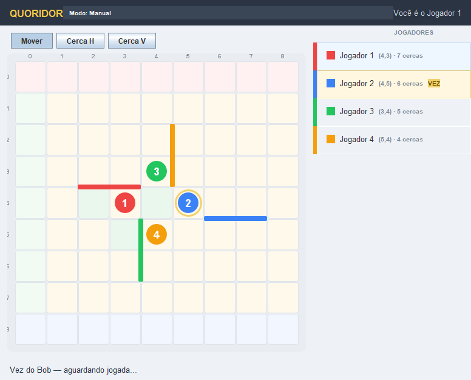

# Quoridor Distribuído (RMI)

Jogo **Quoridor para 4 jogadores** implementado de forma **distribuída** com **Java RMI puro** (`java.rmi`), para a disciplina de **Sistemas Distribuídos**.

- Servidor central com **RMI Registry embutido** (porta 1099) — sem depender do utilitário externo `rmiregistry`.
- 4 clientes (um por jogador) com **callback RMI** para sincronização em tempo real entre todos.
- **Nenhum uso de `java.net.Socket`** — apenas RMI (verificado por teste automatizado `SemSocketTest`).
- Engine de regras 100% testada com JUnit (movimento, pulo, cercas, caminho garantido, vitória, turnos).
- Validação **E2E**: sobe 1 servidor + 4 clientes bot em processos separados e joga uma partida completa até alguém vencer.

---

## Requisitos

- **JDK 17+** (testado com JDK 21 Temurin)
- **Maven 3.9+**

## Como compilar

```bash
mvn clean package
```

O artefato compilado fica em `target/classes` (sem dependências externas além da JDK).

## Como rodar

Em um terminal, inicie o **servidor**:

```bash
java -cp target/classes server.ServerMain
```

Em outros **4 terminais**, inicie cada **jogador**:

```bash
java -cp target/classes client.ClientMain --nome Jogador1
java -cp target/classes client.ClientMain --nome Jogador2
java -cp target/classes client.ClientMain --nome Jogador3
java -cp target/classes client.ClientMain --nome Jogador4
```

A partida **começa automaticamente** quando o 4º jogador entra.

### Argumentos opcionais

| Flag | Aplicável a | Padrão | Descrição |
|------|-------------|--------|-----------|
| `--porta <n>` | servidor e cliente | `1099` | Porta do RMI Registry |
| `--host <host>` | cliente | `localhost` | Host do servidor |
| `--nome <nome>` | cliente | `Jogador` | Nome exibido na partida |
| `--bot` | cliente | — | Modo automático (IA simples) |
| `--gui` | cliente | — | Abre a interface gráfica (Swing) |
| `--modo <manual\|auto>` | cliente | diálogo na abertura | Modo da interface gráfica |

## Comandos do jogador (modo texto)

| Comando | Exemplo | Descrição |
|---------|---------|-----------|
| `mover cima/baixo/esquerda/direita` | `mover cima` | Move o peão 1 casa (ou pula sobre um adversário) |
| `mover <linha> <coluna>` | `mover 3 4` | Move para uma casa específica |
| `cerca <linha> <coluna> <h/v>` | `cerca 4 4 h` | Coloca uma cerca horizontal/vertical |
| `ajuda` | `ajuda` | Mostra os comandos |
| `sair` | `sair` | Sai do cliente |

> Cerca: `linha` e `coluna` vão de **0 a 7** (base da cerca no canto superior-esquerdo do segmento de 2 casas).

## Modo bot (demonstração / validação E2E)

```bash
java -cp target/classes client.ClientMain --nome Bot1 --bot
```

Cada bot decide sua jogada automaticamente: avança em direção à própria meta e, periodicamente, tenta colocar cercas para atrapalhar o oponente mais próximo da vitória.

## Interface gráfica (Swing)

O cliente também possui uma **interface gráfica em Java Swing** com visual "Moderno Plano" — tabuleiro 9×9 com casas, peões coloridos, cercas e destaque da vez, painel lateral de jogadores e barra de status. As **cercas são coloridas pela cor do jogador que as colocou** e cada linha do painel lateral tem uma **barra na cor do jogador**, para identificar rapidamente quem montou cada barreira e quem é quem. Para abri-la, use a flag `--gui`:

```bash
java -cp target/classes client.ClientMain --gui --nome Jogador1
```

### Modo Manual (por cliques)

Quando for a sua vez, as **casas destino legais** são destacadas no tabuleiro; basta clicar para mover o peão. A barra de ferramentas alterna entre **Mover**, **Cerca H** e **Cerca V** — ao mover o mouse sobre o tabuleiro, um **preview** da cerca mostra a aresta candidata (verde = válida, vermelho = inválida), e o **clique direito** alterna a orientação H ↔ V rapidamente. A validação final é sempre do servidor; erros aparecem na barra de status.

### Modo Automático (demonstração)

A janela apenas **exibe** a partida evoluindo sozinha em tempo real, com os 4 processos jogando como bots em um ritmo lento (~1 jogada/2s, partida de ~1 min) — ideal para demonstrar o jogo completo sem intervenção:

```bash
java -cp target/classes client.ClientMain --gui --modo auto --nome Bot1
java -cp target/classes client.ClientMain --gui --modo auto --nome Bot2
java -cp target/classes client.ClientMain --gui --modo auto --nome Bot3
java -cp target/classes client.ClientMain --gui --modo auto --nome Bot4
```

Se `--modo` não for informado, um diálogo pergunta entre **Manual** e **Automático** na abertura.



## Testes

```bash
mvn test
```

| Suíte | Cobertura |
|-------|-----------|
| `TabuleiroTest` (12) | Movimento ortogonal, borda, pulo reto/lateral/bloqueado, sobreposição de cerca, cruzamento, cerca fora do tabuleiro, cerca que isolaria um jogador (rejeitada), vitória pelos 4 lados |
| `PartidaTest` (5) | Ordem de turnos, jogada fora da vez, vitória, movimento inválido, estado inicial (10 cercas e posições corretas) |
| `SemSocketTest` (1) | Varre `src/main/java` e garante que **nenhum** arquivo usa `java.net.Socket`/`new Socket`/`ServerSocket` |
| `E2ETest` (1) | Sobe 1 servidor + 4 clientes bot em **processos separados** e joga uma partida completa, verificando que os 4 clientes recebem o estado final via callback |
| `ui/*` (13) | Geometria (pixel ↔ casa/aresta), cliques do `TabuleiroPanel` (via eventos sintéticos), `PainelJogadores`, `BarraStatus` e `GraphicUI` (construção/estado sem abrir janela) |

## Estrutura

```
src/main/java/
├── common/   interfaces remotas + modelos serializáveis (EstadoJogo, Posicao, Cerca, GameServer, ClientCallback)
├── engine/   regras do jogo, puras e sem RMI (Tabuleiro, Partida)
├── server/   GameServerImpl (lógica RMI + callbacks), ServerMain (registry embutido)
└── client/   ClientCallbackImpl, ConsoleUI, BotJogador, ClientMain
    └── ui/   interface gráfica Swing (GraphicUI, TabuleiroPanel, PainelJogadores, BarraStatus, DialogoModo, Geometria, EstiloUI)
src/test/java/
├── engine/   testes JUnit da engine
├── e2e/      SemSocketTest + E2ETest
└── ui/       testes da interface gráfica
```

Veja **`docs/relatorio.md`** para a explicação detalhada da arquitetura, do protocolo RMI e das decisões de design.
